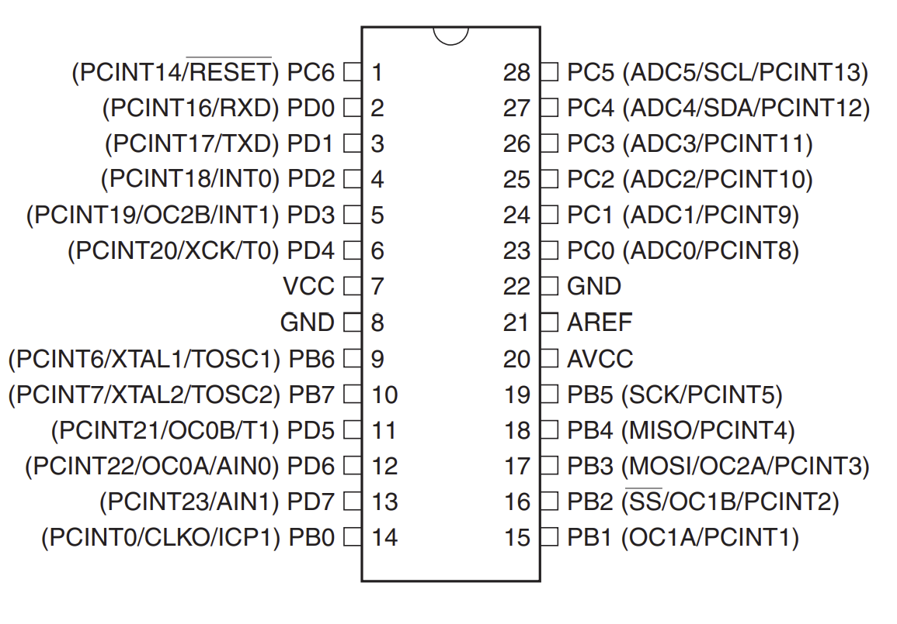

# COMPSYS201 Cheat Sheet

For an overview of interrupts go to the [interrupt page](interrupts/README.md).

## Pin Config

## GPIO
The GPIO ports can be used to read and write digital data to certain pins on the ATMEGA328P. There are 3 different ports which each have a different number of pins:

- Port B: 8 pins
- Port C: (6 pins + RESET) OR 7 pins
- Port D: 8 pins

If you want to detect changes on a pin, you can use the [Pin Change Interrupt](interrupts/README.md#pin-change-interrupt) instead of constantly polling a pin.

#### Functionality Table
The GPIO registers have some extra functionality that can be activated by setting bits in `PORTx` or `PINx` in different modes. When pin `Pxn` (e.g. `PC1`. `PB7`) is configured to read input, setting `PORTxn` will actiavte the pull up resistor for that specific pin. When `Pxn` is configured to write output, setting `PINxn` will invert the value of `PORTxn` on that specific pin. The above functionality is summarised in the table below.

`DDRxn`     | Write `PORTxn`            | Read `PORTxn` | Write `PINxn`     | Read `PINxn`
------------|---------------------------|---------------|-------------------|-------------
0 - input   | Activate pullup resistor  |               |                   | Read @ `PINxn`
1 - output  | Output @ `PORTxn`         |               | Invert `PORTxn`   |    

#### Pull-up Resistors
When a pull-up resistor is activated, it sets an input pin to a known state. This known state is VCC or a binary 1. When a binary 1 is detected on the input pin, the state turns into GND or binary 0. This allows the state of the input on a pin to be known at all times. If the pin is not connected to any other componenet, or you are expecting periods of time where the pin will be disconnected, you should use the pull-up resistor.

Note that this can have the affect of inverting the incoming signal on a pin.

- Disable pull-up resistors: write 1 to `PUD` in `MCUCR`.

## Timers

There are 3 timers in the ATMEGA328P. All timers have 4 different modes of operating (that we care about). These modes are 'Normal Mode', 'CTC Mode', 'Fast PWM Mode' and 'Phase Correct PWM Mode'. All timers have a a prescaler that they can use to decrease the number of ticks the timer counts per second (decreasing accuracy, increasing length). Timers can also generate waveforms. This can be done in 'Normal' and 'CTC' modes but it is not recommended. Instead use a 'PWM' mode for generating high frequency waves.

The normal functionality of timers shall now be listed, then with a separate list below to show notable features of individual timers.

- 8-bit internal counter value
- Prescalers can scale down CPU clock by 8, 64, 256, 1024
- Timers can use an external clock that is on the `T0/T1` pin, but can't prescale external clock
- Timers have an overflow interrupt, a compare with A interrupt and a compare with B interrupt.

Differences:
- Timer 1 has a 16-bit internal counter value
- Timer 2 has more prescaler values: 8, 32, 64, 128, 256, 1024
- Timer 2 can use an external clock (between `TOSC1` and `TOSC2` pins), and prescale it
- Timer 1 has an input detection feature that stores the internal clock value of rising/falling edge into `ICR1` and then triggers an interrupt.

#### CTC Mode
When CTC mode is enabled, the counter is cleared when the internal counter value == `OCRnA`. `OCRnA` provides the top value for the counter.

#### PWM Mode
PWM Mode is the recommended mode for generating waveforms on the `OCnA` and `OCnB` pins. There are 2 different PWM modes: fast and phase correct.

Fast PWM Mode counts from the bottom to the top, then starts from the bottom again.

Phase correct PWM mode count from bottom to the top, then counts back down to the bottom again. 

### Timer 0 
Timer 0 is an 8 bit timer and has no other special features. It has 3 important iterrupts: an overflow interrupt, a compare with a interrupt and a compare with b interrupt. The maximum value Timer 0 can count up to is 256.

Timer 0 also has a few register/flags that define certain values:

- Counter value: `TCNT0` holds the current timer value
- Operation mode control flags: `WGM0[1:0]` in `TCCR0A` and `WGM02` in `TCCR0B`
- Clock select control flags: `CS0[2:0]` in `TCCR0B`
- Output pin control flags: `COM0A[1:0]` and `COM0B[1:0]` in `TCCR0A`
- Output compare registers: `OCR0A` and `OCR0B` are used for certain comparisons the timer makes 
- Output pins: `OC0A` and `OC0B` can be used as output

#### Operation Mode Control Bits

| Mode             | `WGM02` | `WGM01` | `WGM00` | Top   | Update `OCRx` | TOV Flag Set |
|------------------|---------|---------|---------|-------|---------------|--------------|
|Normal            |0 	     |0        |0        |0xFF   |Immediate      |Max           |
|PWM Phase Correct |0 	     |0        |1        |0xFF   |Top            |Bottom        |
|CTC               |0 	     |1        |0        |`OCRA` |Immediate      |Max           |
|Fast PWM          |0 	     |1        |1        |0xFF   |Bottom         |Max           |
|***RESERVED***    |1 	     |0        |0        |       |               |              |
|PWM Phase Correct |1 	     |0        |1        |`OCRA` |Top            |Bottom        |
|***RESERVED***    |1 	     |1        |0        |       |               |              |
|Fast PWM          |1 	     |1        |1        |`OCRA` |Bottom         |Top           |

#### Clock Select Control Bits
| `CS02` | `CS01` | `CS00` | Description |
|--------|--------|--------|-------------|
|0 	     |0 	  |0 	   |No Clock Source (Timer stopped)|
|0 	     |0 	  |1 	   |No prescaler |
|0 	     |1 	  |0 	   |Presclar = 8 |
|0 	     |1 	  |1 	   |Prescaler = 64|
|1 	     |0 	  |0 	   |Prescaler = 256|
|1 	     |0 	  |1 	   |Prescaler = 1024|
|1 	     |1 	  |0 	   |External clock on `T0` pin, clock on falling edge|
|1 	     |1 	  |1 	   |External clock on `T1` pin, clock on rising edge|

#### Output Pin Control Bits
| `COM0x1` | `COM0x2` | Description |
|----------|----------|-------------|
|0         |0         |Normal operation `OC0x` disconnected |
|0         |1         |Toggle `OC0x` on compare match with `OCR0x` |
|1         |0         |Clear  `OC0x` on compare match with `OCR0x` |
|1         |1         |Set `OC0x` on compare match with `OCR0x` |

#### Interrupts

- [Overflow interrupt](interrupts/README.md#timer-overflow-interrupt) 
- [Compare with A interrupt](interrupts/README.md#timer-compare-A-interrupt)
- [Compare with B interrupt](interrupts/README.md#timer-compare-B-interrupt)

