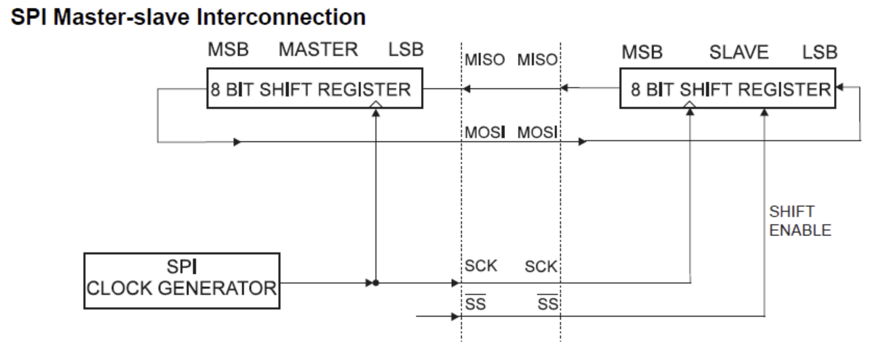

This document contains most of the important information about the ATMEGA328P. This page specifically only address functionality available on the device. For an overview of interrupts go to the [interrupt page](interrupts/README.md).

## Index
1. [Pin Config](#pin-config)
2. [GPIO](#gpio)
3. [Timers](#timers)
	1. [Timer 0](#timer-0)
	2. [Timer 1](#timer-1)
	3. [Timer 2](#timer-2)
4. [ADC](#adc)
5. [Serial Communication](#serial-communication)

---

## Pin Config


---

## GPIO
The GPIO ports can be used to read and write digital data to certain pins on the ATMEGA328P. There are 3 different ports which each have a different number of pins:

- Port B: 8 pins
- Port C: (6 pins + RESET) OR 7 pins
- Port D: 8 pins

If you want to detect changes on a pin, you can use the [Pin Change Interrupt](interrupts/README.md#pin-change-interrupt) instead of constantly polling a pin. Note that if you are using a pin change interrupt you should have `DDRxn` set ti `Read`.

#### Functionality Table
The GPIO registers have some extra functionality that can be activated by setting bits in `PORTx` or `PINx` in different modes. When pin `Pxn` (e.g. `PC1`. `PB7`) is configured to read input, setting `PORTxn` will actiavte the pull up resistor for that specific pin. When `Pxn` is configured to write output, setting `PINxn` will invert the value of `PORTxn` on that specific pin. The above functionality is summarised in the table below.


`DDRxn`     | Write `PORTxn`            | Read `PORTxn` | Write `PINxn`     | Read `PINxn`
------------|---------------------------|---------------|-------------------|-------------
0 - input   | Activate pullup resistor  |               |                   | Read @ `PINxn`
1 - output  | Output @ `PORTxn`         |               | Invert `PORTxn`   |    

#### Pull-up Resistors
When a pull-up resistor is activated, it sets an input pin to a known state. This known state is VCC or a binary 1. When a binary 1 is detected on the input pin, the state turns into GND or binary 0. This allows the state of the input on a pin to be known at all times. If the pin is not connected to any other component, or you are expecting periods of time where the pin will be disconnected, you should use the pull-up resistor.

Note that this can have the affect of inverting the incoming signal on a pin.

- Disable pull-up resistors: write 1 to `PUD` in `MCUCR`.

---

## Timers

There are 3 timers in the ATMEGA328P. All timers have 4 different modes of operating (that we care about). These modes are 'Normal Mode', 'CTC Mode', 'Fast PWM Mode' and 'Phase Correct PWM Mode'. All timers have a prescaler that they can use to decrease the number of ticks the timer counts per second (decreasing accuracy, increasing length). Timers can also generate waveforms. This can be done in 'Normal' and 'CTC' modes but it is not recommended. Instead use a 'PWM' mode for generating high frequency waves.

The normal functionality of timers shall now be listed, then with a separate list below to show notable features of individual timers.

- 8-bit internal counter value
- Prescalers can scale down CPU clock by 8, 64, 256, 1024
- Timers can use an external clock that is on the `T0/T1` pin, but can't prescale external clock
- Timers have an overflow interrupt, a compare with A interrupt and a compare with B interrupt.

Differences:
- Timer 1 has a 16-bit internal counter value
- Timer 2 has more prescaler values: 8, 32, 64, 128, 256, 1024
- Timer 2 can use an external clock (between `TOSC1` and `TOSC2` pins), and prescale it
- Timer 1 has an input detection feature that stores the internal clock value of rising/falling edge into `ICR1` and then triggers an interrupt.
- Timer 0 and Timer 1 share the same prescaler module, but can have different prescaler values set (independently). This doesn't really have much effect on your use case of the timer, apart from resetting the prescaler module. For example, if you reset the prescaler module for Timer 0, this would also affect Timer 1.

#### CTC Mode
When CTC mode is enabled, the counter is cleared when the internal counter value == `OCRnA`. `OCRnA` provides the top value for the counter.

#### PWM Mode
PWM Mode is the recommended mode for generating waveforms on the `OCnA` and `OCnB` pins. There are 2 different PWM modes: fast and phase correct. The way output is generated on `OCnA` and `OCnB` can be configured using the `COMnA[1:0]` and `COMnB[1:0]` flags (check individual timers for more info).

- Fast PWM Mode counts from the bottom to the top, then starts from the bottom again.
- Phase correct PWM mode count from bottom to the top, then counts back down to the bottom again. 

#### Operation Mode Control Bits
The locations of `WGMn0`, `WGMn1` and `WGMn2` can be found under the descriptions for [Timer 0](#timer-0), [Timer 1](#timer-1) and [Timer 2](#timer-2)

| Mode             | `WGMn2` | `WGMn1` | `WGMn0` | Top    | Update `OCRx` | TOV Flag Set |
|------------------|---------|---------|---------|--------|---------------|--------------|
|Normal            |0 	     |0        |0        |0xFF    |Immediate      |Max           |
|PWM Phase Correct |0 	     |0        |1        |0xFF    |Top            |Bottom        |
|CTC               |0 	     |1        |0        |`OCRnA` |Immediate      |Max           |
|Fast PWM          |0 	     |1        |1        |0xFF    |Bottom         |Max           |
|***RESERVED***    |1 	     |0        |0        |        |               |              |
|PWM Phase Correct |1 	     |0        |1        |`OCRnA` |Top            |Bottom        |
|***RESERVED***    |1 	     |1        |0        |        |               |              |
|Fast PWM          |1 	     |1        |1        |`OCRnA` |Bottom         |Top           |

### Timer 0 
Timer 0 is an 8 bit timer and has no other special features. It has 3 important interrupts: an overflow interrupt, a compare with a interrupt and a compare with b interrupt. The range of values Timer 0 can contain is [0, 256) (256 values total).

Timer 0 also has a few register/flags that define certain values:

- Counter value: `TCNT0` holds the current timer value
- Operation mode control flags: `WGM0[1:0]` in `TCCR0A` and `WGM02` in `TCCR0B`
- Clock select control flags: `CS0[2:0]` in `TCCR0B`
- Output pin control flags: `COM0A[1:0]` and `COM0B[1:0]` in `TCCR0A`
- Output compare registers: `OCR0A` and `OCR0B` are used for certain comparisons the timer makes 
- Output pins: `OC0A` and `OC0B` can be used as output


#### Clock Select Control Bits

| `CS02` | `CS01` | `CS00` | Description |
|--------|--------|--------|-------------|
|0 	     |0 	  |0 	   |No Clock Source (Timer stopped)|
|0 	     |0 	  |1 	   |No prescaler |
|0 	     |1 	  |0 	   |Prescaler = 8 |
|0 	     |1 	  |1 	   |Prescaler = 64|
|1 	     |0 	  |0 	   |Prescaler = 256|
|1 	     |0 	  |1 	   |Prescaler = 1024|
|1 	     |1 	  |0 	   |External clock on `T0` pin, clock on falling edge|
|1 	     |1 	  |1 	   |External clock on `T0` pin, clock on rising edge|

#### Output Pin Control Bits

| `COM0x1` | `COM0x2` | Description |
|----------|----------|-------------|
|0         |0         |Normal operation `OC0x` disconnected |
|0         |1         |Toggle `OC0x` on compare match with `OCR0x` |
|1         |0         |Clear  `OC0x` on compare match with `OCR0x` |
|1         |1         |Set `OC0x` on compare match with `OCR0x` |

#### Interrupts

- [Overflow interrupt](interrupts/README.md#timer-overflow-interrupt) 
- [Compare with A interrupt](interrupts/README.md#timer-compare-A-interrupt)
- [Compare with B interrupt](interrupts/README.md#timer-compare-B-interrupt)

#### Example Usage

```c
DDRB |= 1 << 5; // Set PORTB pin 5 as output

OCR0A = 136; // Set the maximum value to 136
TCCR0A |= (1 << WGM01); // Set mode to CTC
TCCR0B |= (1 << CS02); // Set prescaler to 256
TIMSK0 |= (1 << OCIE0A); // Enable compare with A interrupt

sei();
```

### Timer 1
Timer 1 is an 16 bit timer and has an input capture unit. It has 4 important interrupts: an overflow interrupt, a compare with a interrupt, a compare with b interrupt and an input capture event. The range of values Timer 1 can contain is [0, 65536) (65536 values total).

Timer 1's registers are also slightly funky. Any register that has to contain a 16-bit value is composed of low and high registers behind the scenes. For example `TCNT1` is composed of the registers `TCNT1L` and `TCNT1H` which contain the low and high bytes of `TCNT1` respectively. Other registers that are like this are `ICR1`, `OCR1A` and `OCR1B`.

Timer 1 also has a few register/flags that define certain values:

- Counter value register: `TCNT1` holds the current timer value. 
- Input capture value register: `ICR1` contains the value of `TCNT1` when the input capture interrupt occurs. When the input capture interrupt happens, the value of `TCNT1` is copied into `ICR1`. 
- Operation mode control flags: `WGM1[1:0]` in `TCCR1A` and `WGM1[3:2]` in `TCCR1B`
- Clock select control flags: `CS1[2:0]` in `TCCR1B`
- Output pin control flags: `COM1A[1:0]` and `COM1B[1:0]` in `TCCR1A`
- Output compare registers: `OCR1A` and `OCR1B` are used for certain comparisons the timer makes 
- Output pins: `OC1A` and `OC1B` can be used as output
- Input capture pin: `ICP1` can be used as the pin that triggers input capture interrupts.


#### Clock Select Control Bits

| `CS12` | `CS11` | `CS10` | Description |
|--------|--------|--------|-------------|
|0 	     |0 	  |0 	   |No Clock Source (Timer stopped)|
|0 	     |0 	  |1 	   |No prescaler |
|0 	     |1 	  |0 	   |Prescaler = 8 |
|0 	     |1 	  |1 	   |Prescaler = 64|
|1 	     |0 	  |0 	   |Prescaler = 256|
|1 	     |0 	  |1 	   |Prescaler = 1024|
|1 	     |1 	  |0 	   |External clock on `T1` pin, clock on falling edge|
|1 	     |1 	  |1 	   |External clock on `T1` pin, clock on rising edge|

#### Output Pin Control Bits

| `COM1x1` | `COM1x2` | Description |
|----------|----------|-------------|
|1         |0         |Normal operation `OC1x` disconnected |
|0         |1         |Toggle `OC1x` on compare match with `OCR1x` |
|1         |0         |Clear  `OC1x` on compare match with `OCR1x` |
|1         |1         |Set `OC1x` on compare match with `OCR1x` |

#### Interrupts

- [Overflow interrupt](interrupts/README.md#timer-overflow-interrupt) 
- [Compare with A interrupt](interrupts/README.md#timer-compare-A-interrupt)
- [Compare with B interrupt](interrupts/README.md#timer-compare-B-interrupt)
- [Input capture interrupt](interrupts/README.md#timer-1-input-capture-interrupt)

#### Example Usage
See the example usage for [input capture interrupt](interrupts/README.md#timer-1-input-capture-interrupt)

### Timer 2
Timer 2 is an 8 bit timer and has the ability to be asynchronous. This means it can use an external clock instead of the internal clock. Timer 2 also has more prescaler values to select from. It has 3 important iterrupts: an overflow interrupt, a compare with a interrupt and a compare with b interrupt. The range of values Timer 2 can contain is [0, 256) (256 values total).

It is important to note that [Timer 0](#timer-0) and [Timer 1](#timer-1) both have the ability to use an external clock on the `T0` and `T1` pins, but you cannot use any prescalers with their external clocks. Conversely, Timer 2 shares it's prescalers with the internal clock and has a separate registers to select the clock source, allowing prescalers to be set with an external clock. 

Timer 2 also has a few register/flags that define certain values:

- Operation mode control flags: `WGM2[1:0]` in `TCCR2A` and `WGM2[3:2]` in `TCCR2B`
- Clock select control flags: `CS2[2:0]` in `TCCR2B`
- Output pin control flags: `COM2A[1:0]` and `COM2B[1:0]` in `TCCR2A`
- Output compare registers: `OCR2A` and `OCR2B` are used for certain comparisons the timer makes 
- Output pins: `OC2A` and `OC2B` can be used as output
- External clock pin: Clock should be connected betweent the `TOSC1` and `TOSC2` pins.
- External clock select flag: `AS2` in `ASSR`

#### External Clock Select

| AS2 | Description |
|-----|-------------|
|0    | Use internal clock |
|1    | Use external clock |

#### Clock Select Control Bits

| `CS22` | `CS21` | `CS20` | Description |
|--------|--------|--------|-------------|
|0 	     |0 	  |0 	   |No Clock Source (Timer stopped)|
|0 	     |0 	  |1 	   |No prescaler |
|0 	     |1 	  |0 	   |Prescaler = 8 |
|0 	     |1 	  |1 	   |Prescaler = 32|
|1 	     |0 	  |0 	   |Prescaler = 64|
|1 	     |0 	  |1 	   |Prescaler = 128|
|1 	     |1 	  |0 	   |Prescaler = 256|
|1 	     |1 	  |1 	   |Prescaler = 1024|

#### Output Pin Control Bits

| `COM2x1` | `COM2x2` | Description |
|----------|----------|-------------|
|1         |0         |Normal operation `OC2x` disconnected |
|0         |1         |Toggle `OC2x` on compare match with `OCR2x` |
|1         |0         |Clear  `OC2x` on compare match with `OCR2x` |
|1         |1         |Set `OC2x` on compare match with `OCR2x` |

#### Interrupts

- [Overflow interrupt](interrupts/README.md#timer-overflow-interrupt) 
- [Compare with A interrupt](interrupts/README.md#timer-compare-A-interrupt)
- [Compare with B interrupt](interrupts/README.md#timer-compare-B-interrupt)
- [Input capture interrupt](interrupts/README.md#timer-1-input-capture-interrupt)

#### Example Usage
See the example usage for [input capture interrupt](interrupts/README.md#timer-1-input-capture-interrupt)

---

## ADC

The **A**nalog to **D**igital **C**onverter is a piece of hardware on the ATMEGA328P that takes analog voltages in some specified range and converts them to a discrete values. The ADC on the ATMEGA328P has a few notable features:

- 10-bit resolution
- 6 (or 8) multiplexed input channels
- Input voltage range from [0, **VCC**]
- Selectable 1.1V reference voltage
- Temperature sensor input channel
- Interrupt on ADC Conversion Complete

#### Conversion

The ADC converts voltages in the range of [GND, VREF] ([0, VREF]). Any value outside that range will be clipped to the highest or smallest value. The VREF value is selected by using the `REFS[1:0]` flags in `ADMUX`.

VALUE = (Vin * 2^n) / Vref

Resolution = Vref / 2^n (in V/mV)

#### Input Channel Selection

The input pin for the ADC can be selected from multiple different values using `MUX[3:0]` in `ADMUX`. The table of how they can be used is below:

| MUX3 | MUX2 | MUX1 | MUX0 | Input |
|------|------|------|------|-------|
|0     |0	  |0     |0     | `ADC0` pin |
|0     |0	  |0     |1     | `ADC1` pin |
|0     |0	  |1     |0     | `ADC2` pin |
|0     |0	  |1     |1     | `ADC3` pin |
|0     |1	  |0     |0     | `ADC4` pin |
|0     |1	  |0     |1     | `ADC5` pin |
|0     |1	  |1     |0     | `ADC6` pin |
|0     |1	  |1     |1     | `ADC7` pin |
|1     |0	  |0     |0     | `ADC8` pin |
|1     |0	  |0     |1     | ***RESERVED*** |
|1     |0	  |1     |0     | ***RESERVED*** |
|1     |0	  |1     |1     | ***RESERVED*** |
|1     |1	  |0     |0     | ***RESERVED*** |
|1     |1	  |0     |1     | ***RESERVED*** |
|1     |1	  |1     |0     | 1.1V (Vᴮᴳ) |
|1     |1	  |1     |1     | 0V (GND) |

#### Reference Voltage Selection

| REFS1 | REFS0 | Description |
|-------|-------|-------------|
|0      |0      | `AREF` pin, internal Vref is turned off |
|0      |1      | AVcc with external capacitor at `AREF` pin |
|1      |0      | ***RESERVED*** |
|1      |1      | Internal 1.1V reference is used with external capacitor at `AREF` pin |

#### ADC Control and Status Register
The `ADCSRA` registers is an important register that configures many options for the ADC. Below is a list of flags that can be set in the `ADCSRA` register to configure the ADC:

- ADC enable flag: `ADEN`
- ADC start conversion flag: setting the `ADSC` bit will start the ADC conversion.
- ADC interrupt flag: `ADIF` is set to one when the ADC conversion is complete
- ADC interrupt enable flag: `ADIE` activates the ADC conversion complete interrupt
- ADC prescaler bits: `ADPS[2:0]` configure the prescaler value for the ADC

##### ADC Prescaler
This prescaler scales the internal clock frequency. To get the most accurate results, an ADC frequency of 50kHz -> 200kHz is desired. E.g. a 16MHz clock with a prescaler of 128, gives an ADC clock of 125kHz, which is acceptable. The `ADPS[2:0]` flags in the `ADCSRA` register control the prescaler:

| ADPS2 | ADPS1 | ADPS0 | Divisor |
|-------|-------|-------|---------|
|0      |0      |0      |2        |
|0      |0      |1      |2        |
|0      |1      |0      |4        |
|0      |1      |1      |8        |
|1      |0      |0      |16       |
|1      |0      |1      |32       |
|1      |1      |0      |64       |
|1      |1      |1      |128      |

#### ADC Interrupts

- [ADC Complete Interrupt](interrupts/README.md#adc-interrupt)

## Serial Communication
Serial communication is the process of transferring data from one computer to another over 2 or 3 wires. There are multiple different serial protocols (interfaces) for serial communication. The ATMEGA328P has multiple interfaces including "SPI" "USART" and "TWI". In the following sections we will cover the differences between the interfaces, and why each one might be used.

In general there a 3 types of serial communication:
- Simplex (1 wire for data transfer, one-way)
- Half-Duplex (1 wire for data transfer two-way)
- Full-Duplex (2 wires for data transfer two-way, parallel communication)

All types of serial communication also require a clock signal. This means the minimum amount of wires required for serial communication is 2 and the maximum 3 (in the protocols we are covering).

### Serial Peripheral Interace (SPI)
SPI is a **full-duplex** 3-wire data transfer interface. It allows high-speed ***synchronous*** data transfer between the ATMEGA328P and peripheral or other AVR devices.

In SPI data transfer there is one master device, and multiple slave devices. The master can communicate to any slave, and any slave can communicate to the master, but slaves cannot inherently converse among themselves. There are 3 wires used for SPI:

- `MOSI`: Master Out - Slave In. This line is for transferring data from the master to the slave.
- `MISO`: Master In - Slave Out. This line is for transferring data from the slave to the master.
- `SCK`: Serial Clock. The clock is generated by the master, and is used to synchronise data transfer.
- An extra line for each slave `SSn` is controlled by the master to enable any slave. *This line is active low*.

Transfer is initiated by the master pulling a `SSn` pin low on the desired slave. Both devices then prepare the data to be sent into their respective shift registers:



Every clock cycle, a bit is transferred out of the master shift register and into the slave shift register, and vice versa. After each data packet (8-bits) the master synchronises the slave by pulling the `SSn` line high.

### USART
The USART interface is a **full-duplex** 3-wire data transfer interface. It can perform ***asynchronous*** data transfer (the clock can be chosen by the master or slave). It has multiple interesting features:

- High Resolution Baud Rate Generator
- Support for serial frames if 5, 6, 7, 8, or 9 data bits and 1 or 2 stop bits.
- Odd or even parity generation
- Parity check and frame error detection
- 3 separate interrupts on tx complete, tx data register empty and rx complete.

There are 3 different lines in the USART interface:
- `TxD`: The data is transmitted out from the USART through this line
- `RxD`: The data is received by USART through this line
- `XCK`: Clock is used in synchronous operation to synchronise the data transfer

Before any data is transmitted using the USART interface, both USARTs have to be initialised (by master and slave communicating with each other). The process consists of:

- Setting the baud rate
- Setting the frame format
- Enabling the transmitter or the receiver

Data is transmitted in frames in the USART protocol. The frame format is as follows:
- 1 'start' bit (always LOW)
- 5, 6, 7, 8 or 9 data bits
- Optional even or odd parity bit
	- The parity bit is calculated by XORing all the data bits together. If an even parity is used, the result of the XOR is used. If an odd parity is used, the inverse of the XOR is used.
- 1 or 2 stop bits (always HIGH)

#### Interrupts

- [TX Complete Interrupt](interrupts/README.md#usart-tx-complete-interrupt)
- [RX Complete Interrupt](interrupts/README.md#usart-rx-complete-interrupt)
- [TX Data Register Empty](interrupts/README.md#usart-data-register-empty-interrupt)

### TWI
TWI is a **half-duplex** 2-wire ***synchronous*** interface. It allows up to 128 devices to be connected to the master using only 2 bi-directional bus lines.

The wires used are:
- `SDA`: Serial data line
- `SCL`: Serial clock line

All devices on the bus have an assigned 'address'. The device that initiates and terminates a transmission is known as the Master. The Master generates the SCL clock signal, and initiates all transfers. The device placing data on the bus is the transmitter. The device reading data from the bus is the receiver.

Transmission occurs through packets. There are 2 types of packets, address packets and data packets. A data packet is always sent after an address packet:
- Transmission is initiated when the master issues a `START` condition on the bus
	- Falling edge when clock is HIGH
- Address Packet:
	- 7 address bit are put out on the bus (they identify a device)
	- 1 read/write control bit
	- 1 acknowledge bit (sent by receiver)
- Data packet:
	- 8 bits of data
	- 1 acknowledge bit (sent by receiver)
- `STOP` condition issued by master
	- Rising edge when clock is high
